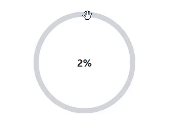

### demo: https://meteoroidalbert.github.io/Functional_components/

### 不定期更新，展示自製的小型功能元件的小型功能元件，只要將特定state在改寫為props來傳遞，即可實踐可重複使用性，歡迎參閱

| 圖片                      | 說明                |
|---------------------------|---------------------|
|  |1.可自訂起點位置  2.可自訂範圍  3.藉由拖曳行為改變進度條 |
